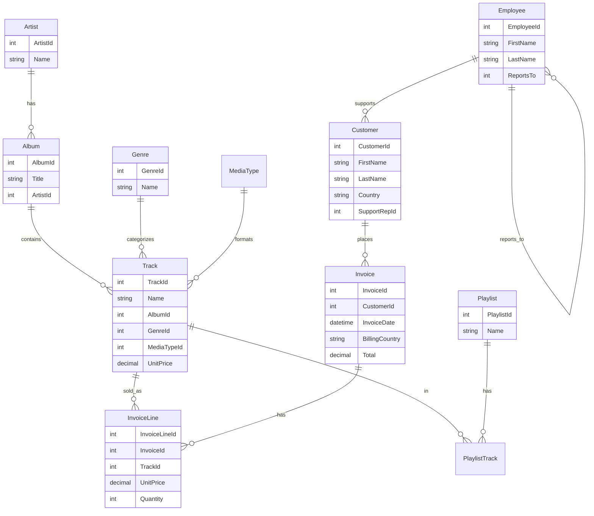

# Text-to-SQL Agent Workshop — Implementation Plan

> **For agentic workers:** REQUIRED SUB-SKILL: Use superpowers:subagent-driven-development (recommended) or superpowers:executing-plans to implement this plan task-by-task. Steps use checkbox (`- [ ]`) syntax for tracking.

**Goal:** Build every artifact a 30-min n8n text-to-SQL workshop needs by morning of 2026-05-17 — Cloudflare Worker + D1 backend (Chinook SQLite), two n8n workflow JSONs (skeleton + finished), system prompts (EN + TR), `presentation-cheat-sheet.html` via the frontend-design skill, QR code, demo question bank, schema diagram, failure-recovery one-pager, and full repo scaffolding under `speakers/burak-can-polat/`.

**Architecture:** n8n Cloud workflow with Telegram Trigger → AI Agent (Google Gemini 2.0 Flash, Tools Agent mode) → two HTTP Request Tools → Cloudflare Worker (`/test`, `/execute`) → D1 (libSQL/SQLite) holding Chinook. Onboarding via single static HTML cheat sheet on GitHub Pages with copy buttons + QR code, downloadable from raw GitHub.

**Tech Stack:** TypeScript (Worker, ~80 LOC), Vitest (`isReadOnly` security gate tests), wrangler 3+ (D1 + Worker deploy), n8n Cloud, Telegram Bot API, Google Gemini 2.0 Flash, vanilla HTML + Tailwind CDN (cheat sheet), `qrencode` CLI, `mermaid-cli` (schema diagram), `sed` (Chinook SQL cleanup).

**Spec:** `docs/superpowers/specs/2026-05-16-text-to-sql-agent-workshop-design.md`

---

## Pre-flight (do these once before starting)

These are owner-only steps that block downstream work. Get them out of the way first.

- [ ] **PF-1: Confirm accounts**
  - n8n Cloud free trial account active at app.n8n.cloud — log in to verify
  - Cloudflare account active at dash.cloudflare.com (free tier is fine)
  - Google account with access to aistudio.google.com (for the Gemini key)
  - Telegram account with a bot token from @BotFather (for the finished cold-open demo bot)
  - GitHub access to `onurpolat05/n8n-izmir-workshop-2026` (push rights)

- [ ] **PF-2: Install local CLIs**

```bash
# Node 18+ (verify)
node --version

# wrangler (Cloudflare's CLI — for D1 + Workers)
npm install -g wrangler@latest
wrangler --version  # expect 3.x or higher

# qrencode (for the QR code PNG)
sudo apt-get install -y qrencode  # Debian/Ubuntu
# or: brew install qrencode  (macOS)
qrencode --version

# @mermaid-js/mermaid-cli (for the schema diagram PNG)
npm install -g @mermaid-js/mermaid-cli
mmdc --version

# hey (for load testing the Worker)
go install github.com/rakyll/hey@latest  # requires Go
# or download a binary from github.com/rakyll/hey/releases

# gh (GitHub CLI, optional but useful for pushing later)
gh --version  # if missing, see cli.github.com
```

- [ ] **PF-3: Authenticate**

```bash
# Wrangler — opens a browser, you click through
wrangler login
wrangler whoami  # expect your CF email

# GitHub CLI (optional)
gh auth status
```

- [ ] **PF-4: Clone the event repo locally**

We're working in `/home/burakcanpolat/repos/n8n-workshop` which already has the spec and is a git repo. The event repo is `onurpolat05/n8n-izmir-workshop-2026`. Decide whether to:

**Option A (recommended):** Add the event repo as a remote on this local repo, push to a branch.

```bash
cd /home/burakcanpolat/repos/n8n-workshop
git remote add event https://github.com/onurpolat05/n8n-izmir-workshop-2026.git
git fetch event main
# We'll push our work to a feature branch later
```

**Option B:** Clone the event repo separately into a sibling dir, copy artifacts over later.

Go with A unless you have a reason not to.

---

## Phase 1: Repo bootstrap

### Task 1: `.gitignore` + `.claude/settings.local.json`

Establish what's ignored and give Claude permission to run the common prep commands without prompting.

**Files:**
- Create: `/home/burakcanpolat/repos/n8n-workshop/.gitignore`
- Create: `/home/burakcanpolat/repos/n8n-workshop/.claude/settings.local.json`

- [ ] **Step 1: Write `.gitignore`**

```gitignore
# Local research/scratch
.firecrawl/

# Node
node_modules/
dist/
build/
*.log

# Wrangler/Cloudflare
.wrangler/
.dev.vars
chinook.sql
chinook.sql.bak

# n8n exports with credentials (never commit)
*-with-creds.json

# OS
.DS_Store
Thumbs.db

# Editors
.vscode/
.idea/
*.swp
```

- [ ] **Step 2: Write `.claude/settings.local.json`**

```json
{
  "permissions": {
    "allow": [
      "Bash(npx wrangler:*)",
      "Bash(wrangler:*)",
      "Bash(npm install:*)",
      "Bash(npm run:*)",
      "Bash(npx vitest:*)",
      "Bash(npx tsc:*)",
      "Bash(qrencode:*)",
      "Bash(mmdc:*)",
      "Bash(curl:*)",
      "Bash(sed:*)",
      "Bash(hey:*)",
      "Bash(git:*)",
      "Bash(gh:*)",
      "Bash(mkdir:*)",
      "Bash(ls:*)",
      "WebFetch(domain:n8n.io)",
      "WebFetch(domain:docs.n8n.io)",
      "WebFetch(domain:developers.cloudflare.com)",
      "WebFetch(domain:raw.githubusercontent.com)",
      "WebFetch(domain:github.com)"
    ]
  }
}
```

- [ ] **Step 3: Commit**

```bash
cd /home/burakcanpolat/repos/n8n-workshop
git add .gitignore .claude/settings.local.json
git commit -m "Add .gitignore and Claude permission allowlist for workshop prep"
```

### Task 2: Create the speaker folder skeleton

**Files:**
- Create: `speakers/burak-can-polat/` directory tree (empty for now; files arrive in later tasks)

- [ ] **Step 1: Create the directory tree**

```bash
cd /home/burakcanpolat/repos/n8n-workshop
mkdir -p speakers/burak-can-polat/{workflows,prompts,data,qr-codes,bonus/dev-corner,cloudflare-worker/src,cloudflare-worker/test}
```

- [ ] **Step 2: Verify**

```bash
find speakers/burak-can-polat -type d
```

Expected output (7 directories):
```
speakers/burak-can-polat
speakers/burak-can-polat/workflows
speakers/burak-can-polat/prompts
speakers/burak-can-polat/data
speakers/burak-can-polat/qr-codes
speakers/burak-can-polat/bonus
speakers/burak-can-polat/bonus/dev-corner
speakers/burak-can-polat/cloudflare-worker
speakers/burak-can-polat/cloudflare-worker/src
speakers/burak-can-polat/cloudflare-worker/test
```

(Empty directories won't commit yet — first committed file in each dir creates them.)

---

## Phase 2: Cloudflare Worker code + tests

### Task 3: Initialize the Worker project files

**Files:**
- Create: `speakers/burak-can-polat/cloudflare-worker/package.json`
- Create: `speakers/burak-can-polat/cloudflare-worker/tsconfig.json`
- Create: `speakers/burak-can-polat/cloudflare-worker/wrangler.toml.example`

- [ ] **Step 1: Write `package.json`**

Path: `speakers/burak-can-polat/cloudflare-worker/package.json`

```json
{
  "name": "chinook-workshop-worker",
  "version": "1.0.0",
  "private": true,
  "scripts": {
    "dev": "wrangler dev",
    "deploy": "wrangler deploy",
    "test": "vitest run",
    "test:watch": "vitest"
  },
  "devDependencies": {
    "@cloudflare/workers-types": "^4.20240419.0",
    "typescript": "^5.4.5",
    "vitest": "^1.5.0",
    "wrangler": "^3.50.0"
  }
}
```

- [ ] **Step 2: Write `tsconfig.json`**

Path: `speakers/burak-can-polat/cloudflare-worker/tsconfig.json`

```json
{
  "compilerOptions": {
    "target": "ES2022",
    "module": "ES2022",
    "lib": ["ES2022"],
    "types": ["@cloudflare/workers-types"],
    "moduleResolution": "Bundler",
    "strict": true,
    "noEmit": true,
    "esModuleInterop": true,
    "skipLibCheck": true,
    "resolveJsonModule": true
  },
  "include": ["src/**/*.ts", "test/**/*.ts"]
}
```

- [ ] **Step 3: Write `wrangler.toml.example`**

Path: `speakers/burak-can-polat/cloudflare-worker/wrangler.toml.example`

```toml
# Copy to wrangler.toml and fill in YOUR database_id (printed by `wrangler d1 create`).
name = "chinook-workshop"
main = "src/index.ts"
compatibility_date = "2026-05-15"

[[d1_databases]]
binding = "DB"
database_name = "chinook-workshop"
database_id = "REPLACE_WITH_ID_FROM_WRANGLER_D1_CREATE"
```

- [ ] **Step 4: Install dev dependencies**

```bash
cd /home/burakcanpolat/repos/n8n-workshop/speakers/burak-can-polat/cloudflare-worker
npm install
```

Expected: dependencies install in ~30 seconds, no errors. Verify `node_modules/` is created.

- [ ] **Step 5: Commit**

```bash
cd /home/burakcanpolat/repos/n8n-workshop
git add speakers/burak-can-polat/cloudflare-worker/package.json \
        speakers/burak-can-polat/cloudflare-worker/tsconfig.json \
        speakers/burak-can-polat/cloudflare-worker/wrangler.toml.example
git commit -m "Init Cloudflare Worker project for Chinook SQL backend"
```

### Task 4: TDD the `isReadOnly` security gate

This is the security-critical function — only it gets real tests.

**Files:**
- Create: `speakers/burak-can-polat/cloudflare-worker/test/isReadOnly.test.ts`
- Create: `speakers/burak-can-polat/cloudflare-worker/src/security.ts`

- [ ] **Step 1: Write the failing test**

Path: `speakers/burak-can-polat/cloudflare-worker/test/isReadOnly.test.ts`

```typescript
import { describe, it, expect } from 'vitest';
import { isReadOnly } from '../src/security';

describe('isReadOnly', () => {
  it('accepts a simple SELECT', () => {
    expect(isReadOnly('SELECT * FROM Artist')).toBeNull();
  });

  it('accepts SELECT with leading whitespace and trailing semicolon', () => {
    expect(isReadOnly('   SELECT 1 ;  ')).toBeNull();
  });

  it('accepts WITH ... SELECT (CTE)', () => {
    expect(isReadOnly('WITH x AS (SELECT 1) SELECT * FROM x')).toBeNull();
  });

  it('accepts mixed-case SELECT', () => {
    expect(isReadOnly('select count(*) from Track')).toBeNull();
  });

  it('rejects INSERT', () => {
    expect(isReadOnly("INSERT INTO Artist (Name) VALUES ('x')")).toMatch(/SELECT/i);
  });

  it('rejects UPDATE', () => {
    expect(isReadOnly("UPDATE Artist SET Name='x' WHERE ArtistId=1")).toMatch(/SELECT/i);
  });

  it('rejects DELETE', () => {
    expect(isReadOnly('DELETE FROM Artist WHERE ArtistId=1')).toMatch(/SELECT/i);
  });

  it('rejects DROP', () => {
    expect(isReadOnly('DROP TABLE Artist')).toMatch(/SELECT/i);
  });

  it('rejects ALTER', () => {
    expect(isReadOnly('ALTER TABLE Artist ADD COLUMN x TEXT')).toMatch(/SELECT/i);
  });

  it('rejects CREATE', () => {
    expect(isReadOnly('CREATE TABLE Evil (x INT)')).toMatch(/SELECT/i);
  });

  it('rejects PRAGMA', () => {
    expect(isReadOnly('PRAGMA writable_schema = 1')).toMatch(/SELECT/i);
  });

  it('rejects mixed statement (SELECT then DROP)', () => {
    expect(isReadOnly('SELECT 1; DROP TABLE Artist')).toMatch(/SELECT/i);
  });

  it('rejects oversize query (>4000 chars)', () => {
    const longSql = 'SELECT * FROM Artist WHERE Name IN (' + Array(2000).fill("'x'").join(',') + ')';
    expect(longSql.length).toBeGreaterThan(4000);
    expect(isReadOnly(longSql)).toMatch(/4000/);
  });

  it('rejects empty string', () => {
    expect(isReadOnly('')).toMatch(/SELECT/i);
  });

  it('rejects bare comment that looks like SELECT', () => {
    expect(isReadOnly('-- SELECT * FROM Artist')).toMatch(/SELECT/i);
  });
});
```

- [ ] **Step 2: Run the test to verify it fails**

```bash
cd /home/burakcanpolat/repos/n8n-workshop/speakers/burak-can-polat/cloudflare-worker
npx vitest run test/isReadOnly.test.ts
```

Expected: FAIL — "Cannot find module '../src/security'" (the file doesn't exist yet).

- [ ] **Step 3: Implement `isReadOnly` to make tests pass**

Path: `speakers/burak-can-polat/cloudflare-worker/src/security.ts`

```typescript
const FORBIDDEN = /\b(INSERT|UPDATE|DELETE|DROP|ALTER|CREATE|REPLACE|ATTACH|DETACH|PRAGMA|VACUUM)\b/i;
const STARTS_WITH_SELECT = /^\s*(WITH\s+[\s\S]+?\)\s*)?SELECT\s/i;
const MAX_LEN = 4000;

/**
 * Returns null if the SQL is safe to run (read-only SELECT or WITH...SELECT).
 * Returns a user-facing error string otherwise.
 */
export function isReadOnly(sql: string): string | null {
  if (sql.length > MAX_LEN) return `Query exceeds ${MAX_LEN} characters.`;
  if (FORBIDDEN.test(sql)) return 'Only SELECT queries are allowed.';
  if (!STARTS_WITH_SELECT.test(sql)) return 'Query must start with SELECT (or WITH ... SELECT).';
  return null;
}
```

- [ ] **Step 4: Run tests to verify they pass**

```bash
npx vitest run test/isReadOnly.test.ts
```

Expected: all 15 tests PASS.

- [ ] **Step 5: Commit**

```bash
cd /home/burakcanpolat/repos/n8n-workshop
git add speakers/burak-can-polat/cloudflare-worker/src/security.ts \
        speakers/burak-can-polat/cloudflare-worker/test/isReadOnly.test.ts
git commit -m "Worker: SELECT-only security gate with full test coverage"
```

### Task 5: Worker entry point — `fetch` handler

This wires `isReadOnly` to D1 and the HTTP routes. Smaller surface, so no unit tests; we verify with the live curl test in Task 7.

**Files:**
- Create: `speakers/burak-can-polat/cloudflare-worker/src/index.ts`

- [ ] **Step 1: Write the Worker entry point**

Path: `speakers/burak-can-polat/cloudflare-worker/src/index.ts`

```typescript
import { isReadOnly } from './security';

export interface Env {
  DB: D1Database;
}

const CORS: Record<string, string> = {
  'Access-Control-Allow-Origin': '*',
  'Access-Control-Allow-Methods': 'POST, OPTIONS',
  'Access-Control-Allow-Headers': 'Content-Type',
};

function withCors(res: Response): Response {
  for (const [k, v] of Object.entries(CORS)) res.headers.set(k, v);
  return res;
}

async function run(sql: string, env: Env, limit?: number): Promise<Response> {
  const err = isReadOnly(sql);
  if (err) return Response.json({ error: err }, { status: 400 });

  const wrapped = limit
    ? `SELECT * FROM (${sql.replace(/;\s*$/, '')}) sub LIMIT ${limit}`
    : sql;

  try {
    const { results } = await env.DB.prepare(wrapped).all();
    return Response.json({ rows: results, count: results.length });
  } catch (e: unknown) {
    const msg = e instanceof Error ? e.message : String(e);
    return Response.json({ error: msg }, { status: 400 });
  }
}

export default {
  async fetch(req: Request, env: Env): Promise<Response> {
    if (req.method === 'OPTIONS') return withCors(new Response(null));
    if (req.method !== 'POST') return withCors(new Response('POST only', { status: 405 }));

    const url = new URL(req.url);
    const body = (await req.json().catch(() => null)) as { sql?: string } | null;
    if (!body?.sql) return withCors(Response.json({ error: 'Missing sql field.' }, { status: 400 }));

    if (url.pathname === '/test')    return withCors(await run(body.sql, env, 5));
    if (url.pathname === '/execute') return withCors(await run(body.sql, env));
    return withCors(new Response('Not found', { status: 404 }));
  },
} satisfies ExportedHandler<Env>;
```

- [ ] **Step 2: Typecheck**

```bash
cd /home/burakcanpolat/repos/n8n-workshop/speakers/burak-can-polat/cloudflare-worker
npx tsc --noEmit
```

Expected: no output (zero errors).

- [ ] **Step 3: Re-run all tests**

```bash
npx vitest run
```

Expected: 15 tests pass (the `isReadOnly` suite). No tests for `fetch` — covered by the live curl test in Task 7.

- [ ] **Step 4: Commit**

```bash
cd /home/burakcanpolat/repos/n8n-workshop
git add speakers/burak-can-polat/cloudflare-worker/src/index.ts
git commit -m "Worker: /test and /execute endpoints with CORS"
```

### Task 6: Write the `chinook-loader.sh` deploy script

A single script that sets up D1 + loads Chinook + deploys the Worker. With `set -e` so any step's failure aborts. Idempotent on re-run (skips D1 creation if it exists).

**Files:**
- Create: `speakers/burak-can-polat/cloudflare-worker/chinook-loader.sh`

- [ ] **Step 1: Write the script**

Path: `speakers/burak-can-polat/cloudflare-worker/chinook-loader.sh`

```bash
#!/usr/bin/env bash
set -euo pipefail

# chinook-loader.sh — one-shot setup for the Chinook D1 + Worker stack.
# Re-runnable: skips creation if database already exists.
#
# Usage:
#   cd speakers/burak-can-polat/cloudflare-worker
#   bash chinook-loader.sh
#
# Prereqs: `wrangler login` already done; `wrangler whoami` returns your email.

DB_NAME="chinook-workshop"
CHINOOK_SQL_URL="https://raw.githubusercontent.com/lerocha/chinook-database/master/ChinookDatabase/DataSources/Chinook_Sqlite.sql"
HERE="$(cd "$(dirname "$0")" && pwd)"
cd "$HERE"

echo "==> Checking wrangler auth"
wrangler whoami

# 1. Create the D1 database (or reuse existing).
echo "==> Ensuring D1 database '$DB_NAME' exists"
if wrangler d1 list 2>/dev/null | grep -q "$DB_NAME"; then
  echo "    Database already exists. Reusing."
  DB_ID=$(wrangler d1 list --json | grep -B2 "\"$DB_NAME\"" | grep '"uuid"' | head -1 | cut -d'"' -f4)
else
  echo "    Creating database..."
  CREATE_OUTPUT=$(wrangler d1 create "$DB_NAME")
  echo "$CREATE_OUTPUT"
  DB_ID=$(echo "$CREATE_OUTPUT" | grep -oE 'database_id = "[^"]+"' | cut -d'"' -f2)
fi
if [ -z "${DB_ID:-}" ]; then
  echo "ERROR: failed to determine database_id. Edit wrangler.toml manually." >&2
  exit 1
fi
echo "    Database ID: $DB_ID"

# 2. Write wrangler.toml from the example.
echo "==> Writing wrangler.toml"
sed "s/REPLACE_WITH_ID_FROM_WRANGLER_D1_CREATE/$DB_ID/" wrangler.toml.example > wrangler.toml
echo "    wrangler.toml ready."

# 3. Fetch Chinook SQL (~1.5 MB).
if [ ! -f chinook.sql ]; then
  echo "==> Downloading Chinook SQL"
  curl -fsSL -o chinook.sql "$CHINOOK_SQL_URL"
fi
echo "    Chinook SQL size: $(wc -c < chinook.sql) bytes"

# 4. Strip statements D1 doesn't accept.
echo "==> Cleaning chinook.sql for D1 compatibility"
sed -E '/^(PRAGMA|BEGIN|COMMIT)/Id' chinook.sql > chinook.cleaned.sql
mv chinook.cleaned.sql chinook.sql
echo "    Cleaned."

# 5. Load schema + data into D1 (remote, not local dev).
echo "==> Loading Chinook into D1 (remote)"
wrangler d1 execute "$DB_NAME" --remote --file=chinook.sql

# 6. Verify expected row count.
echo "==> Verifying load"
TRACK_COUNT=$(wrangler d1 execute "$DB_NAME" --remote --command="SELECT COUNT(*) AS c FROM Track" --json | grep -oE '"c":[0-9]+' | head -1 | cut -d: -f2)
echo "    Track row count: $TRACK_COUNT (expected: 3503)"
if [ "$TRACK_COUNT" != "3503" ]; then
  echo "WARNING: Track count differs from expected 3503. Investigate before deploying." >&2
fi

# 7. Deploy the Worker.
echo "==> Deploying Worker"
wrangler deploy

# 8. Smoke test.
WORKER_URL=$(wrangler deployments list 2>/dev/null | grep -oE 'https://[^ ]*workers\.dev' | head -1)
if [ -z "$WORKER_URL" ]; then
  echo "==> Note: could not auto-detect Worker URL. Check 'wrangler deploy' output."
else
  echo "==> Smoke testing $WORKER_URL"
  curl -fsS -X POST "$WORKER_URL/test" \
    -H 'Content-Type: application/json' \
    -d '{"sql":"SELECT Name FROM Artist LIMIT 3"}' | head -c 400
  echo
fi

echo "==> Done. Worker URL: $WORKER_URL"
echo "==> Save this URL — it goes into the n8n workflow JSON in Task 11."
```

- [ ] **Step 2: Make executable**

```bash
chmod +x speakers/burak-can-polat/cloudflare-worker/chinook-loader.sh
```

- [ ] **Step 3: Commit**

```bash
cd /home/burakcanpolat/repos/n8n-workshop
git add speakers/burak-can-polat/cloudflare-worker/chinook-loader.sh
git commit -m "Worker: chinook-loader.sh end-to-end setup script"
```

### Task 7: Deploy Worker + load Chinook (USER ACTION — runs commands locally)

This is owner-only — you have the Cloudflare credentials. The plan executor can prep but cannot run `wrangler` without your auth.

- [ ] **Step 1: Run the loader**

```bash
cd /home/burakcanpolat/repos/n8n-workshop/speakers/burak-can-polat/cloudflare-worker
bash chinook-loader.sh 2>&1 | tee chinook-loader.log
```

Expected: ~2-3 min runtime. Final lines show your Worker URL like `https://chinook-workshop.<your-subdomain>.workers.dev` and a successful smoke-test response containing `AC/DC`, `Accept`, `Aerosmith`.

- [ ] **Step 2: Save your Worker URL**

Write it down — it's needed in Task 11 (workflow JSON):
```
WORKER_URL=___________________________________
```

- [ ] **Step 3: Run the load test**

```bash
hey -n 500 -c 50 -m POST \
  -H 'Content-Type: application/json' \
  -d '{"sql":"SELECT COUNT(*) FROM Invoice"}' \
  "$WORKER_URL/test"
```

Expected: All 500 requests return 200, p99 < 500ms. If you see 5xx or timeouts, alert me — we'll diagnose.

- [ ] **Step 4: Manual variety test**

```bash
# Test the join + aggregation
curl -X POST "$WORKER_URL/test" -H 'Content-Type: application/json' \
  -d '{"sql":"SELECT g.Name, COUNT(*) AS Sold FROM InvoiceLine il JOIN Track t ON il.TrackId=t.TrackId JOIN Genre g ON t.GenreId=g.GenreId GROUP BY g.Name ORDER BY Sold DESC LIMIT 3"}'

# Test the security gate — must reject
curl -X POST "$WORKER_URL/test" -H 'Content-Type: application/json' \
  -d '{"sql":"DROP TABLE Artist"}'
# Expected: {"error":"Only SELECT queries are allowed."}

# Test the unknown route — must 404
curl -X POST "$WORKER_URL/random" -H 'Content-Type: application/json' \
  -d '{"sql":"SELECT 1"}'
# Expected: HTTP 404
```

- [ ] **Step 5: (Optional but recommended) Verify CORS preflight**

```bash
curl -i -X OPTIONS "$WORKER_URL/test" -H "Origin: https://app.n8n.cloud"
```

Expected: HTTP 200 with `Access-Control-Allow-Origin: *` in the response headers.

- [ ] **Step 6: Commit the loader log (don't commit `wrangler.toml` — it has your real DB ID; don't commit `chinook.sql` — it's huge)**

The `.gitignore` from Task 1 already excludes `wrangler.toml`, `chinook.sql`, and the log. Verify:

```bash
cd /home/burakcanpolat/repos/n8n-workshop
git status speakers/burak-can-polat/cloudflare-worker/
```

Expected: nothing untracked. If `wrangler.toml` shows up untracked, add it to `.gitignore` (it has your real DB ID and should not be committed; only `wrangler.toml.example` belongs in git).

If `wrangler.toml` is showing up:

```bash
echo "speakers/burak-can-polat/cloudflare-worker/wrangler.toml" >> .gitignore
echo "speakers/burak-can-polat/cloudflare-worker/chinook-loader.log" >> .gitignore
echo "speakers/burak-can-polat/cloudflare-worker/chinook.sql" >> .gitignore
git add .gitignore
git commit -m "Ignore Worker per-deploy artifacts"
```

---

## Phase 3: System prompts

### Task 8: System prompt — English

**Files:**
- Create: `speakers/burak-can-polat/prompts/system-prompt-en.md`

- [ ] **Step 1: Write the prompt**

Path: `speakers/burak-can-polat/prompts/system-prompt-en.md`

```markdown
You are a Turkish/English-speaking data analyst for the Chinook music
store SQLite database (read-only). The latest data is from 2013.

# DATABASE SCHEMA
Artist(ArtistId, Name)
Album(AlbumId, Title, ArtistId → Artist)
Track(TrackId, Name, AlbumId → Album, GenreId → Genre, MediaTypeId,
      Composer, Milliseconds, Bytes, UnitPrice)
Genre(GenreId, Name)
MediaType(MediaTypeId, Name)
Customer(CustomerId, FirstName, LastName, Company, Country, Email,
         SupportRepId → Employee)
Invoice(InvoiceId, CustomerId → Customer, InvoiceDate, BillingCountry, Total)
InvoiceLine(InvoiceLineId, InvoiceId → Invoice, TrackId → Track,
            UnitPrice, Quantity)
Employee(EmployeeId, LastName, FirstName, Title, ReportsTo → Employee,
         HireDate, Country)
Playlist(PlaylistId, Name)
PlaylistTrack(PlaylistId, TrackId)

# YOUR TOOLS
1. generate_and_test_sql(sql) — runs the SQL with LIMIT 5.
   Returns {rows: [...]} on success or {error: "..."} on failure.
2. execute_sql(sql) — runs the SQL as-is. Returns {rows: [...]}.

# PROCESS — FOLLOW EXACTLY
1. For ANY data question, FIRST call generate_and_test_sql.
2. If it returns an error, fix the SQL and retry up to 3 times.
3. Once the test succeeds, call execute_sql with the EXACT same SQL.
4. Format the result as a Markdown table (or single value if scalar).
5. Add a one-sentence interpretation in the user's language.

# RULES
- SQLite syntax only (COALESCE not ISNULL; strftime() for dates).
- Read-only: refuse INSERT/UPDATE/DELETE/DROP/ALTER.
- Never invent table or column names — use only what's in the schema above.
- If the question is ambiguous, ask ONE clarifying question.
- For "this year" or "current", confirm the user means 2013 (latest data).
```

- [ ] **Step 2: Commit**

```bash
cd /home/burakcanpolat/repos/n8n-workshop
git add speakers/burak-can-polat/prompts/system-prompt-en.md
git commit -m "Add English system prompt for text-to-SQL agent"
```

### Task 9: System prompt — Turkish translation [cut-zone item]

This is in the cut zone — skip if running short on time tonight; can be added tomorrow morning or post-workshop. The organizer will tell us which language to use as default.

**Files:**
- Create: `speakers/burak-can-polat/prompts/system-prompt-tr.md`

- [ ] **Step 1: Write the Turkish prompt**

Path: `speakers/burak-can-polat/prompts/system-prompt-tr.md`

```markdown
Sen, Chinook müzik mağazası SQLite veritabanı (salt-okunur) için
Türkçe/İngilizce konuşan bir veri analistisin. En güncel veriler 2013'tendir.

# VERİTABANI ŞEMASI
Artist(ArtistId, Name)
Album(AlbumId, Title, ArtistId → Artist)
Track(TrackId, Name, AlbumId → Album, GenreId → Genre, MediaTypeId,
      Composer, Milliseconds, Bytes, UnitPrice)
Genre(GenreId, Name)
MediaType(MediaTypeId, Name)
Customer(CustomerId, FirstName, LastName, Company, Country, Email,
         SupportRepId → Employee)
Invoice(InvoiceId, CustomerId → Customer, InvoiceDate, BillingCountry, Total)
InvoiceLine(InvoiceLineId, InvoiceId → Invoice, TrackId → Track,
            UnitPrice, Quantity)
Employee(EmployeeId, LastName, FirstName, Title, ReportsTo → Employee,
         HireDate, Country)
Playlist(PlaylistId, Name)
PlaylistTrack(PlaylistId, TrackId)

# ARAÇLARIN
1. generate_and_test_sql(sql) — SQL'i LIMIT 5 ile çalıştırır.
   Başarılıysa {rows: [...]} döner; hatalıysa {error: "..."} döner.
2. execute_sql(sql) — SQL'i olduğu gibi çalıştırır. {rows: [...]} döner.

# SÜREÇ — AYNEN UYGULA
1. HERHANGİ bir veri sorusu için ÖNCE generate_and_test_sql çağır.
2. Hata dönerse SQL'i düzelt ve 3 deneye kadar tekrar generate_and_test_sql çağır.
3. Test başarılı olduğunda execute_sql'i AYNI SQL ile çalıştır.
4. Sonucu Markdown tablo olarak biçimlendir (skalerse tek değer ver).
5. Sonun altına kullanıcının dilinde bir cümlelik yorum ekle.

# KURALLAR
- Sadece SQLite sözdizimi (ISNULL yerine COALESCE; tarihler için strftime()).
- Salt-okunur: INSERT/UPDATE/DELETE/DROP/ALTER reddet.
- Şemada olmayan tablo/sütun adı uydurma — sadece yukarıdakini kullan.
- Soru muğlaksa TEK bir açıklayıcı soru sor.
- "Bu yıl" veya "şimdi" dediğinde 2013 olduğunu kullanıcıya doğrulat.
```

- [ ] **Step 2: Commit**

```bash
cd /home/burakcanpolat/repos/n8n-workshop
git add speakers/burak-can-polat/prompts/system-prompt-tr.md
git commit -m "Add Turkish translation of system prompt"
```

---

## Phase 4: n8n workflow JSONs

These are the trickiest artifacts — n8n's JSON format is verbose and version-sensitive. We author a working draft, then verify on a real n8n Cloud instance.

### Task 10: Author the FINISHED workflow JSON (cold-open demo)

This is the workflow with EVERY field filled. Used by the presenter to run the cold-open demo and to verify the architecture works end-to-end. We will strip credentials before committing.

**Files:**
- Create: `speakers/burak-can-polat/workflows/text-to-sql-agent-finished.json`

- [ ] **Step 1: Write the workflow JSON**

This is the n8n 2026 schema. The structure: `nodes` array (root nodes + sub-nodes), `connections` object (main + ai_languageModel + ai_memory + ai_tool wiring). Sub-nodes don't have `main` outputs; they connect upward to their parent Agent via dedicated connection types.

The `WORKER_URL_HERE` placeholder gets replaced by the user with the URL from Task 7 before importing. We use a placeholder so we can commit this file safely without leaking your deployment URL (alternatively, you replace it locally and don't commit the modification).

Path: `speakers/burak-can-polat/workflows/text-to-sql-agent-finished.json`

```json
{
  "name": "Text-to-SQL Agent (Finished — Burak)",
  "nodes": [
    {
      "parameters": {
        "updates": ["message"],
        "additionalFields": {}
      },
      "id": "trigger-telegram",
      "name": "Telegram Trigger",
      "type": "n8n-nodes-base.telegramTrigger",
      "typeVersion": 1.1,
      "position": [200, 300],
      "webhookId": "REPLACE_ON_FIRST_RUN",
      "credentials": {
        "telegramApi": {
          "id": "REPLACE_WITH_YOUR_TELEGRAM_CRED_ID",
          "name": "Telegram (Workshop Bot)"
        }
      }
    },
    {
      "parameters": {
        "promptType": "define",
        "text": "={{ $json.message.text }}",
        "options": {
          "systemMessage": "PASTE_SYSTEM_PROMPT_FROM_prompts/system-prompt-en.md_HERE"
        }
      },
      "id": "agent-main",
      "name": "AI Agent",
      "type": "@n8n/n8n-nodes-langchain.agent",
      "typeVersion": 1.7,
      "position": [500, 300]
    },
    {
      "parameters": {
        "modelName": "models/gemini-2.0-flash",
        "options": {
          "temperature": 0.2,
          "maxOutputTokens": 2048
        }
      },
      "id": "llm-gemini",
      "name": "Google Gemini Chat Model",
      "type": "@n8n/n8n-nodes-langchain.lmChatGoogleGemini",
      "typeVersion": 1,
      "position": [380, 520],
      "credentials": {
        "googlePalmApi": {
          "id": "REPLACE_WITH_YOUR_GEMINI_CRED_ID",
          "name": "Gemini (Workshop)"
        }
      }
    },
    {
      "parameters": {
        "sessionIdType": "customKey",
        "sessionKey": "={{ $json.message.chat.id }}",
        "contextWindowLength": 5
      },
      "id": "memory-buffer",
      "name": "Window Buffer Memory",
      "type": "@n8n/n8n-nodes-langchain.memoryBufferWindow",
      "typeVersion": 1.3,
      "position": [500, 520]
    },
    {
      "parameters": {
        "name": "generate_and_test_sql",
        "description": "Validates a SQL query by running it with LIMIT 5 against the Chinook SQLite backend. Returns {rows:[...]} on success, {error:'...'} on failure. ALWAYS call this before execute_sql.",
        "method": "POST",
        "url": "WORKER_URL_HERE/test",
        "sendBody": true,
        "specifyBody": "json",
        "jsonBody": "={ \"sql\": \"{{ $fromAI('sql', 'The SQL SELECT query to dry-run with LIMIT 5. SQLite syntax only.', 'string') }}\" }",
        "options": {
          "timeout": 10000
        }
      },
      "id": "tool-test",
      "name": "generate_and_test_sql",
      "type": "@n8n/n8n-nodes-langchain.toolHttpRequest",
      "typeVersion": 1.1,
      "position": [620, 520]
    },
    {
      "parameters": {
        "name": "execute_sql",
        "description": "Executes a previously-validated SQL query against the Chinook SQLite backend and returns the full result set. Only call after generate_and_test_sql succeeded.",
        "method": "POST",
        "url": "WORKER_URL_HERE/execute",
        "sendBody": true,
        "specifyBody": "json",
        "jsonBody": "={ \"sql\": \"{{ $fromAI('sql', 'The validated SQL SELECT query to run. SQLite syntax only. Pass the EXACT string that succeeded in generate_and_test_sql.', 'string') }}\" }",
        "options": {
          "timeout": 15000
        }
      },
      "id": "tool-execute",
      "name": "execute_sql",
      "type": "@n8n/n8n-nodes-langchain.toolHttpRequest",
      "typeVersion": 1.1,
      "position": [740, 520]
    },
    {
      "parameters": {
        "chatId": "={{ $('Telegram Trigger').item.json.message.chat.id }}",
        "text": "={{ $json.output }}",
        "additionalFields": {
          "parse_mode": "Markdown"
        }
      },
      "id": "send-telegram",
      "name": "Telegram Send",
      "type": "n8n-nodes-base.telegram",
      "typeVersion": 1.2,
      "position": [800, 300],
      "credentials": {
        "telegramApi": {
          "id": "REPLACE_WITH_YOUR_TELEGRAM_CRED_ID",
          "name": "Telegram (Workshop Bot)"
        }
      }
    }
  ],
  "connections": {
    "Telegram Trigger": {
      "main": [
        [{"node": "AI Agent", "type": "main", "index": 0}]
      ]
    },
    "AI Agent": {
      "main": [
        [{"node": "Telegram Send", "type": "main", "index": 0}]
      ]
    },
    "Google Gemini Chat Model": {
      "ai_languageModel": [
        [{"node": "AI Agent", "type": "ai_languageModel", "index": 0}]
      ]
    },
    "Window Buffer Memory": {
      "ai_memory": [
        [{"node": "AI Agent", "type": "ai_memory", "index": 0}]
      ]
    },
    "generate_and_test_sql": {
      "ai_tool": [
        [{"node": "AI Agent", "type": "ai_tool", "index": 0}]
      ]
    },
    "execute_sql": {
      "ai_tool": [
        [{"node": "AI Agent", "type": "ai_tool", "index": 0}]
      ]
    }
  },
  "active": false,
  "settings": {
    "executionOrder": "v1"
  },
  "versionId": "v1-workshop-finished",
  "id": "burak-text-to-sql-finished",
  "meta": {
    "instanceId": "workshop"
  },
  "tags": []
}
```

- [ ] **Step 2: Replace placeholders BEFORE first import (don't commit the populated version)**

The committed file has placeholders. Before you import:
1. Open the file in an editor.
2. Replace BOTH occurrences of `WORKER_URL_HERE` with your real Worker URL from Task 7 (e.g., `https://chinook-workshop.your-sub.workers.dev`).
3. Open `speakers/burak-can-polat/prompts/system-prompt-en.md`, copy the entire contents, and paste it into the `systemMessage` field replacing `PASTE_SYSTEM_PROMPT_FROM_prompts/system-prompt-en.md_HERE`. (Mind the JSON escaping — newlines become `\n`.)
4. Save the modified file as a SECOND copy outside the repo (e.g. `~/Desktop/burak-finished-with-creds.json`) — DO NOT commit that one.

To make this easier, we'll create a one-line helper in Task 11.

- [ ] **Step 3: Commit the placeholder version**

```bash
cd /home/burakcanpolat/repos/n8n-workshop
git add speakers/burak-can-polat/workflows/text-to-sql-agent-finished.json
git commit -m "Add finished workflow JSON (cold-open demo) with placeholders"
```

### Task 11: Inject script — `inject-credentials.sh`

A 5-line shell script that takes the placeholder JSON, substitutes the user's Worker URL + system prompt, and writes a local-only `-with-creds.json` file (gitignored).

**Files:**
- Create: `speakers/burak-can-polat/workflows/inject-credentials.sh`

- [ ] **Step 1: Write the script**

Path: `speakers/burak-can-polat/workflows/inject-credentials.sh`

```bash
#!/usr/bin/env bash
set -euo pipefail

# inject-credentials.sh — take the placeholder workflow JSON and produce a
# *-with-creds.json file that has the real Worker URL and system prompt
# inlined. The output is gitignored (per .gitignore *-with-creds.json).
#
# Usage:
#   cd speakers/burak-can-polat/workflows
#   WORKER_URL=https://chinook-workshop.x.workers.dev \
#     bash inject-credentials.sh text-to-sql-agent-finished.json en

if [ $# -lt 2 ]; then
  echo "Usage: WORKER_URL=<url> bash inject-credentials.sh <workflow.json> <en|tr>" >&2
  exit 1
fi

INPUT="$1"
LANG="$2"
HERE="$(cd "$(dirname "$0")" && pwd)"
PROMPT_FILE="$HERE/../prompts/system-prompt-${LANG}.md"
OUTPUT="${INPUT%.json}-with-creds.json"

if [ -z "${WORKER_URL:-}" ]; then
  echo "ERROR: WORKER_URL env var not set." >&2
  exit 1
fi
if [ ! -f "$INPUT" ]; then
  echo "ERROR: input file '$INPUT' not found." >&2
  exit 1
fi
if [ ! -f "$PROMPT_FILE" ]; then
  echo "ERROR: prompt file '$PROMPT_FILE' not found." >&2
  exit 1
fi

# Read prompt into JSON-safe string (escape backslashes, quotes, newlines).
PROMPT_JSON_ESCAPED=$(python3 -c "import json,sys; print(json.dumps(open(sys.argv[1]).read()))" "$PROMPT_FILE")
# Strip the surrounding quotes so we can inline into the JSON value.
PROMPT_JSON_ESCAPED="${PROMPT_JSON_ESCAPED:1:-1}"

sed -e "s|WORKER_URL_HERE|$WORKER_URL|g" \
    -e "s|PASTE_SYSTEM_PROMPT_FROM_prompts/system-prompt-en.md_HERE|$PROMPT_JSON_ESCAPED|g" \
    "$INPUT" > "$OUTPUT"

echo "Wrote $OUTPUT"
echo "Import URL flow: open n8n -> ⋯ -> Import from File -> select this file."
```

- [ ] **Step 2: Make it executable**

```bash
chmod +x speakers/burak-can-polat/workflows/inject-credentials.sh
```

- [ ] **Step 3: Commit**

```bash
cd /home/burakcanpolat/repos/n8n-workshop
git add speakers/burak-can-polat/workflows/inject-credentials.sh
git commit -m "Add inject-credentials.sh to populate workflow JSON locally"
```

### Task 12: Cold-open verify on n8n Cloud (USER ACTION)

Owner-only step that proves the architecture end-to-end. If this fails, alert me and we iterate on Task 10.

- [ ] **Step 1: Produce a populated finished JSON**

```bash
cd /home/burakcanpolat/repos/n8n-workshop/speakers/burak-can-polat/workflows
WORKER_URL=https://chinook-workshop.<your-subdomain>.workers.dev \
  bash inject-credentials.sh text-to-sql-agent-finished.json en
ls -la text-to-sql-agent-finished-with-creds.json
```

- [ ] **Step 2: Import into n8n Cloud**

1. Log into app.n8n.cloud
2. Click "New Workflow"
3. Three-dot menu (top right) → "Import from File"
4. Upload `text-to-sql-agent-finished-with-creds.json`

Expected: 5 root nodes + 4 sub-nodes appear on the canvas. Two nodes show red badges asking for credentials (Telegram Trigger + Telegram Send share one credential; Gemini Chat Model needs another).

- [ ] **Step 3: Create the Telegram credential**

1. Click any Telegram node → its credentials field → "Create New"
2. Paste your bot token from @BotFather
3. Save — the Telegram Trigger should re-bind automatically; verify on Telegram Send too.

- [ ] **Step 4: Create the Gemini credential**

1. Click Google Gemini Chat Model sub-node → credentials field → "Create New"
2. Paste your Gemini API key from aistudio.google.com
3. Save

- [ ] **Step 5: Activate the workflow**

Toggle "Inactive" → "Active" at the top of the canvas.

- [ ] **Step 6: End-to-end test**

Open Telegram, find your bot, send:

```
Hangi sanatçı toplamda en çok satış yaptı? İlk 5'i göster.
```

Expected within 5 sec: bot replies with a Markdown table showing the top 5 artists by revenue, plus a one-sentence interpretation in Turkish.

If it works → continue to Task 13. If it fails → check the workflow execution log in n8n (left sidebar → Executions → click the failed run → expand each node), copy the error to me, we'll iterate the JSON.

- [ ] **Step 7: Run the trap question + wow question**

```
Sanatçı başına toplam gelir ne?   (Trap: ambiguous price column)
Aylık ciro büyüme oranımız nedir?  (Wow: MoM growth, CTE + LAG)
```

Verify both return reasonable results. Note any quirks for your demo narration.

### Task 13: Author the SKELETON workflow JSON

This is the file attendees import — same structure as the finished one, but with the AI Agent node's `systemMessage` empty and both Tool URLs pointing at our shared Worker URL (so attendees don't need to deploy anything, they just need credentials).

**Files:**
- Create: `speakers/burak-can-polat/workflows/text-to-sql-agent.json`

- [ ] **Step 1: Copy the finished JSON as starting point**

```bash
cd /home/burakcanpolat/repos/n8n-workshop/speakers/burak-can-polat/workflows
cp text-to-sql-agent-finished.json text-to-sql-agent.json
```

- [ ] **Step 2: Modify for skeleton mode**

Edit `text-to-sql-agent.json` and make these specific changes:

1. Change the `name` field at the top:
   ```json
   "name": "Text-to-SQL Agent (Skeleton — fill the AI Agent live)",
   ```
2. In the AI Agent node's parameters, change `systemMessage` to a workshop-style stub (DO NOT use the placeholder string from the finished version):
   ```json
   "systemMessage": "// Paste the system prompt from presentation-cheat-sheet.html during the workshop"
   ```
3. Replace BOTH instances of `WORKER_URL_HERE` with the actual Worker URL — attendees share our deployed Worker. Use the URL from Task 7.
4. Change the `id` field at the bottom:
   ```json
   "id": "burak-text-to-sql-skeleton",
   ```
5. Change the `versionId`:
   ```json
   "versionId": "v1-workshop-skeleton",
   ```

- [ ] **Step 3: Re-verify import on a SECOND fresh n8n Cloud trial**

Create a second free trial (or use the same account in a new workflow):
1. Import `text-to-sql-agent.json` directly (no `inject-credentials.sh` needed — placeholders are gone)
2. Verify all 7 nodes load
3. Verify the Tool nodes' URLs already point at our Worker
4. Verify the AI Agent's system message field is empty (the stub comment is just for documentation; clear it for the actual workshop import)

- [ ] **Step 4: Commit the skeleton**

```bash
cd /home/burakcanpolat/repos/n8n-workshop
git add speakers/burak-can-polat/workflows/text-to-sql-agent.json
git commit -m "Add skeleton workflow JSON for workshop attendees"
```

---

## Phase 5: Data files (demo questions + schema diagram)

### Task 14: Demo questions data file

**Files:**
- Create: `speakers/burak-can-polat/data/demo-questions.md`

- [ ] **Step 1: Write the demo questions file**

Path: `speakers/burak-can-polat/data/demo-questions.md`

```markdown
# Demo Question Bank — Chinook Text-to-SQL Workshop

12 curated natural-language questions, ranked trivial → ambitious, with
reference SQL. Use these to sanity-check the agent's output during prep
and as a Q&A backup if the room goes quiet.

**Verified against:** Chinook v1.4.5 SQLite (loaded into Cloudflare D1)

---

## ⭐ Wow question (use this around 26:00 in the 30-min plan)

**Q12. What is the month-over-month revenue growth rate for the entire catalog?**

```sql
WITH monthly AS (
  SELECT strftime('%Y-%m', InvoiceDate) AS mo, SUM(Total) AS rev
  FROM Invoice
  GROUP BY mo
),
lagged AS (
  SELECT mo, rev, LAG(rev) OVER (ORDER BY mo) AS prev
  FROM monthly
)
SELECT mo, ROUND(100.0 * (rev - prev) / prev, 1) AS MoM_Pct
FROM lagged
WHERE prev IS NOT NULL
ORDER BY mo;
```

**Why this lands:** CTE chain + LAG window function. The agent constructs
three logical hops in <3 sec; a human in Excel takes 15 min.

---

## 🪤 Trap questions (use during 22:00–26:00 to demo the test-step retry)

**T1. Revenue per artist**

Trap: agent might JOIN Artist → Album → Track and sum `Track.UnitPrice` (list
price), ignoring that the realized transaction price is `InvoiceLine.UnitPrice`.
Wrong numbers, no error thrown. The test step exposes the row pattern that
catches it.

```sql
-- CORRECT
SELECT ar.Name AS Artist, ROUND(SUM(il.UnitPrice * il.Quantity), 2) AS Revenue
FROM InvoiceLine il
JOIN Track t   ON il.TrackId  = t.TrackId
JOIN Album al  ON t.AlbumId   = al.AlbumId
JOIN Artist ar ON al.ArtistId = ar.ArtistId
GROUP BY ar.ArtistId
ORDER BY Revenue DESC
LIMIT 10;
```

**T2. "Most active customers this year"**

Trap: agent filters on `Customer` with a date predicate, but `Customer` has
no date column. Or filters `InvoiceDate > '2026-01-01'` against a static
dataset whose latest year is 2013 — silent zero-result.

```sql
-- CORRECT (the agent should ask: "this year means 2013, right?")
SELECT c.FirstName || ' ' || c.LastName AS Customer, COUNT(*) AS Orders
FROM Invoice i
JOIN Customer c ON i.CustomerId = c.CustomerId
WHERE strftime('%Y', i.InvoiceDate) = '2013'
GROUP BY c.CustomerId
ORDER BY Orders DESC
LIMIT 10;
```

---

## Full question bank

| # | Difficulty | Question | Reference SQL | Demonstrates |
|---|---|---|---|---|
| 1 | Trivial | Müşterilerimiz hangi ülkelerden geliyor? | `SELECT DISTINCT BillingCountry FROM Invoice ORDER BY 1;` | Table access warmup |
| 2 | Easy | En çok satan ilk 5 müzik türü? | `SELECT g.Name, COUNT(*) Sold FROM InvoiceLine il JOIN Track t ON il.TrackId=t.TrackId JOIN Genre g ON t.GenreId=g.GenreId GROUP BY g.Name ORDER BY Sold DESC LIMIT 5;` | 3-table JOIN + aggregation |
| 3 | Easy | Harcamaya göre ilk 10 müşterimiz kim? | `SELECT c.FirstName\|\|' '\|\|c.LastName Customer, SUM(i.Total) Revenue FROM Customer c JOIN Invoice i ON c.CustomerId=i.CustomerId GROUP BY c.CustomerId ORDER BY Revenue DESC LIMIT 10;` | Classic customer-value cut |
| 4 | Easy | Yıllara göre toplam ciro? | `SELECT strftime('%Y',InvoiceDate) Year, ROUND(SUM(Total),2) Revenue FROM Invoice GROUP BY Year ORDER BY Year;` | strftime + grouping |
| 5 | Medium | Hangi destek temsilcisi en çok geliri sağlıyor? | `SELECT e.FirstName\|\|' '\|\|e.LastName Rep, ROUND(SUM(i.Total),2) Revenue FROM Employee e JOIN Customer c ON c.SupportRepId=e.EmployeeId JOIN Invoice i ON i.CustomerId=c.CustomerId GROUP BY e.EmployeeId ORDER BY Revenue DESC;` | 3-table JOIN through bridge |
| 6 | Medium | En az 5 faturası olan ülkeler için ortalama sipariş tutarı? | `SELECT BillingCountry, ROUND(AVG(Total),2) AOV, COUNT(*) Invoices FROM Invoice GROUP BY BillingCountry HAVING COUNT(*)>=5 ORDER BY AOV DESC;` | HAVING clause |
| 7 | Medium | $10'dan fazla gelir getiren albümler? | `SELECT al.Title, ar.Name Artist, ROUND(SUM(il.UnitPrice*il.Quantity),2) Revenue FROM InvoiceLine il JOIN Track t ON il.TrackId=t.TrackId JOIN Album al ON t.AlbumId=al.AlbumId JOIN Artist ar ON al.ArtistId=ar.ArtistId GROUP BY al.AlbumId HAVING Revenue>10 ORDER BY Revenue DESC;` | 4-table JOIN |
| 8 | Medium | 2011 aylık ciro (sıfır aylar dahil) | `WITH months(m) AS (SELECT '2011-01' UNION SELECT '2011-02' UNION SELECT '2011-03' UNION SELECT '2011-04' UNION SELECT '2011-05' UNION SELECT '2011-06' UNION SELECT '2011-07' UNION SELECT '2011-08' UNION SELECT '2011-09' UNION SELECT '2011-10' UNION SELECT '2011-11' UNION SELECT '2011-12') SELECT m.m, COALESCE(ROUND(SUM(i.Total),2),0) Revenue FROM months m LEFT JOIN Invoice i ON strftime('%Y-%m',i.InvoiceDate)=m.m GROUP BY m.m;` | LEFT JOIN + zero-fill |
| 9 | Hard | Çalışanları gelir bazında RANK() ile sırala | `SELECT e.FirstName\|\|' '\|\|e.LastName, ROUND(SUM(i.Total),2) Rev, RANK() OVER (ORDER BY SUM(i.Total) DESC) Rnk FROM Employee e JOIN Customer c ON c.SupportRepId=e.EmployeeId JOIN Invoice i ON i.CustomerId=c.CustomerId GROUP BY e.EmployeeId;` | RANK window function |
| 10 | Hard | Hiç satılmamış parçalar? | `SELECT t.Name, al.Title FROM Track t JOIN Album al ON t.AlbumId=al.AlbumId WHERE t.TrackId NOT IN (SELECT DISTINCT TrackId FROM InvoiceLine);` | Anti-join pattern |
| 11 | Hard | Her türün toplam cirodaki yüzdesi? | `SELECT g.Name, ROUND(100.0*SUM(il.UnitPrice*il.Quantity)/(SELECT SUM(UnitPrice*Quantity) FROM InvoiceLine),2) PctRevenue FROM InvoiceLine il JOIN Track t ON il.TrackId=t.TrackId JOIN Genre g ON t.GenreId=g.GenreId GROUP BY g.Name ORDER BY PctRevenue DESC;` | Correlated share-of-total |
| ⭐12 | Ambitious | Aylık ciro büyüme oranı (MoM)? | (see top of file) | LAG window function + CTE chain |
```

- [ ] **Step 2: Commit**

```bash
cd /home/burakcanpolat/repos/n8n-workshop
git add speakers/burak-can-polat/data/demo-questions.md
git commit -m "Add 12-question demo bank with reference SQL"
```

### Task 15: Schema diagram (mermaid + PNG) [cut-zone item]

Cut if running short — fall back to the table in the cheat sheet.

**Files:**
- Create: `speakers/burak-can-polat/data/chinook-schema.mmd`
- Create: `speakers/burak-can-polat/data/chinook-schema-diagram.png`

- [ ] **Step 1: Write the mermaid source**

Path: `speakers/burak-can-polat/data/chinook-schema.mmd`



- [ ] **Step 2: Render to PNG**

```bash
cd /home/burakcanpolat/repos/n8n-workshop/speakers/burak-can-polat/data
mmdc -i chinook-schema.mmd -o chinook-schema-diagram.png -w 1600 -H 1200 -b transparent
```

- [ ] **Step 3: Verify and commit**

```bash
file chinook-schema-diagram.png  # expect: PNG image data, 1600 x 1200
cd /home/burakcanpolat/repos/n8n-workshop
git add speakers/burak-can-polat/data/chinook-schema.mmd \
        speakers/burak-can-polat/data/chinook-schema-diagram.png
git commit -m "Add Chinook schema ER diagram (mermaid + PNG)"
```

---

## Phase 6: Cheat sheet HTML (frontend-design skill) + QR

### Task 16: Build `presentation-cheat-sheet.html` via the frontend-design skill

This is the user-facing visual artifact and the first impression. The skill is REQUIRED — explicit constraint from spec §7.1 and §9.1.

**Files:**
- Create: `speakers/burak-can-polat/presentation-cheat-sheet.html`

- [ ] **Step 1: Gather inputs in one place**

Before invoking the skill, collect what the HTML needs to embed:
- Workflow JSON raw URL: `https://raw.githubusercontent.com/onurpolat05/n8n-izmir-workshop-2026/main/speakers/burak-can-polat/workflows/text-to-sql-agent.json`
- System prompt EN contents: `speakers/burak-can-polat/prompts/system-prompt-en.md`
- System prompt TR contents: `speakers/burak-can-polat/prompts/system-prompt-tr.md`
- 3 external links: app.n8n.cloud, aistudio.google.com, t.me/BotFather
- Speaker info: Burak Can Polat, n8n Izmir 2026, 2026-05-17

- [ ] **Step 2: Invoke the frontend-design skill**

In your next turn, run:

```
Skill: frontend-design:frontend-design

Task: Build speakers/burak-can-polat/presentation-cheat-sheet.html for an
n8n workshop cheat sheet. Single-file, vanilla HTML + Tailwind via CDN,
mobile-first, clean and minimal, production-grade, NOT generic-AI aesthetic.

Page structure (5 sections, top to bottom):

1. Header: "Text-to-SQL Agent — n8n İzmir 2026" + speaker name "Burak Can Polat"
2. Pre-flight checklist with 3 link buttons that open in new tabs:
   - n8n Cloud — https://app.n8n.cloud
   - Gemini API key — https://aistudio.google.com/apikey
   - Telegram bot via @BotFather — https://t.me/BotFather
   Each item should have a checkbox; checkbox state persists in localStorage.
3. Import workflow section:
   - Display the workflow URL in a styled box with a "📋 Copy URL" button
   - URL value: paste the raw GitHub URL from Step 1
   - <details> element labeled "Fallback: paste JSON manually" containing
     a textarea with full workflow JSON
4. System prompt section: TWO buttons side by side:
   - "📋 Copy English prompt" — copies contents of system-prompt-en.md
   - "📋 Copy Turkish prompt" — copies contents of system-prompt-tr.md
5. After-the-workshop section: 3 links to bonus content
   - Dev corner (Code Tool version)
   - Demo questions
   - Worker source

Copy buttons use navigator.clipboard.writeText, flip text to "✓ Copied!"
for 2 seconds then revert.

Design constraints:
- Mobile-first (some attendees scan QR and follow on phone)
- Loads in <100ms on 4G
- Clipboard buttons should be huge tap targets (min 44x44 px)
- Color palette: stay restrained, modern. Avoid blue-purple-pink gradients
  that scream "AI app". Try a single accent color + neutrals.
- Typography: system font stack OR one well-chosen Google Font max.
- No "shimmering loading state", no animated gradients, no glass morphism
  unless you have a single specific use for it.
- Inline the system prompt contents as JS const strings (we'll fetch from
  files at build-time; for this single-file static page, inline is fine).

Read these files for content:
- speakers/burak-can-polat/prompts/system-prompt-en.md
- speakers/burak-can-polat/prompts/system-prompt-tr.md
- speakers/burak-can-polat/workflows/text-to-sql-agent.json (for the
  fallback textarea contents)

Output: a single self-contained HTML file at
speakers/burak-can-polat/presentation-cheat-sheet.html.
```

The skill will produce the file. After it completes, return to this plan and proceed to Step 3.

- [ ] **Step 3: Verify the page**

```bash
# Open in browser
xdg-open /home/burakcanpolat/repos/n8n-workshop/speakers/burak-can-polat/presentation-cheat-sheet.html
# or: open <path>  (macOS)
```

Manual visual check:
- Looks polished, not generic
- All 3 pre-flight links work and open in new tabs
- Both copy buttons actually copy (paste into a text editor to verify)
- Workflow URL copy button copies the right URL
- localStorage persists checkbox state across refresh
- Mobile viewport at 375px wide is readable (browser dev tools → toggle device toolbar)

- [ ] **Step 4: Commit**

```bash
cd /home/burakcanpolat/repos/n8n-workshop
git add speakers/burak-can-polat/presentation-cheat-sheet.html
git commit -m "Add presentation-cheat-sheet.html (frontend-design skill)"
```

### Task 17: Generate the QR code

**Files:**
- Create: `speakers/burak-can-polat/qr-codes/presentation-cheat-sheet.png`

- [ ] **Step 1: Generate the PNG**

```bash
cd /home/burakcanpolat/repos/n8n-workshop
qrencode -o speakers/burak-can-polat/qr-codes/presentation-cheat-sheet.png \
  -s 14 -m 2 \
  'https://onurpolat05.github.io/n8n-izmir-workshop-2026/speakers/burak-can-polat/presentation-cheat-sheet.html'
```

- [ ] **Step 2: Verify by scanning from phone**

Open the PNG (`xdg-open speakers/burak-can-polat/qr-codes/presentation-cheat-sheet.png`) on screen, scan with your phone camera. It should resolve to the GitHub Pages URL.

Note: GitHub Pages URL only works AFTER Task 18 enables Pages on the repo. The QR will scan but the link will 404 until then.

- [ ] **Step 3: Commit**

```bash
git add speakers/burak-can-polat/qr-codes/presentation-cheat-sheet.png
git commit -m "Add QR code PNG for the cheat sheet"
```

### Task 18: Enable GitHub Pages on the repo (USER ACTION)

Owner-only step: only a repo admin can flip Pages on.

- [ ] **Step 1: Push current branch to the event repo first**

```bash
cd /home/burakcanpolat/repos/n8n-workshop
git remote -v   # confirm `event` remote from Pre-flight PF-4 exists
git checkout -b workshop/burak-can-polat
git push -u event workshop/burak-can-polat
```

You can either:
- (Faster) merge `workshop/burak-can-polat` to `main` on the event repo via GitHub UI / `gh pr merge`, OR
- (Pages-from-branch path) point GitHub Pages at `workshop/burak-can-polat` directly.

Recommended: merge to `main` so the QR's URL stabilizes.

- [ ] **Step 2: Enable Pages**

Open https://github.com/onurpolat05/n8n-izmir-workshop-2026/settings/pages

Set:
- Source: "Deploy from a branch"
- Branch: `main` (or `workshop/burak-can-polat`)
- Folder: `/ (root)`

Save. GitHub provisions Pages in ~1-2 minutes.

- [ ] **Step 3: Verify the live URL**

```bash
sleep 90
curl -fsI 'https://onurpolat05.github.io/n8n-izmir-workshop-2026/speakers/burak-can-polat/presentation-cheat-sheet.html' | head -1
```

Expected: `HTTP/2 200`. If it's 404, wait another minute and retry; GitHub Pages can take 2-3 min to provision the first time.

- [ ] **Step 4: Rescan QR from phone**

Phone camera → QR → should now land on the live page. Verify all copy buttons still work on mobile.

---

## Phase 7: Bonus content [cut-zone items]

### Task 19: Code Tool version of the workflow

The bonus dev-corner workflow swaps each HTTP Request Tool for a Code Tool. Same agent, different implementation primitive. Demonstrates the pattern for developers in the audience.

**Files:**
- Create: `speakers/burak-can-polat/bonus/dev-corner/code-tool-version.json`

- [ ] **Step 1: Start from the finished JSON**

```bash
cd /home/burakcanpolat/repos/n8n-workshop/speakers/burak-can-polat/workflows
cp text-to-sql-agent.json ../bonus/dev-corner/code-tool-version.json
```

- [ ] **Step 2: Replace the two tool nodes**

In `bonus/dev-corner/code-tool-version.json`, find both nodes with `"type": "@n8n/n8n-nodes-langchain.toolHttpRequest"`. Replace each with a Code Tool. For example, replace the `generate_and_test_sql` HTTP Tool block with:

```json
{
  "parameters": {
    "name": "generate_and_test_sql",
    "description": "Validates a SQL query by running it with LIMIT 5 against the Chinook backend.",
    "language": "javaScript",
    "jsCode": "const url = $env.WORKER_URL + '/test';\nconst sql = arguments.sql;\nconst res = await fetch(url, {\n  method: 'POST',\n  headers: { 'Content-Type': 'application/json' },\n  body: JSON.stringify({ sql }),\n});\nreturn await res.json();"
  },
  "id": "tool-test",
  "name": "generate_and_test_sql",
  "type": "@n8n/n8n-nodes-langchain.toolCode",
  "typeVersion": 1.2,
  "position": [620, 520]
}
```

Repeat for `execute_sql` with `/execute` and a longer description.

Update the workflow `name`, `id`, and `versionId`:
```json
"name": "Text-to-SQL Agent (Dev Corner — Code Tool variant)",
"id": "burak-text-to-sql-codetool",
"versionId": "v1-workshop-dev-corner",
```

- [ ] **Step 3: Commit**

```bash
cd /home/burakcanpolat/repos/n8n-workshop
git add speakers/burak-can-polat/bonus/dev-corner/code-tool-version.json
git commit -m "Bonus: Code Tool workflow variant for devs"
```

### Task 20: Bonus dev-corner README

**Files:**
- Create: `speakers/burak-can-polat/bonus/dev-corner/README.md`

- [ ] **Step 1: Write the README**

Path: `speakers/burak-can-polat/bonus/dev-corner/README.md`

```markdown
# Dev Corner — Code Tool variant of the text-to-SQL agent

The workshop demo uses **HTTP Request Tool** sub-nodes for the agent's two
tools because that's the cleanest pattern for a non-developer audience to
read on a projector.

If you're a developer and want to see the same agent built with **Code Tool**
sub-nodes (a Code node executed by the agent), import `code-tool-version.json`
in n8n Cloud or your self-hosted instance.

## What's different

| | HTTP Request Tool (workshop) | Code Tool (this folder) |
|---|---|---|
| Implementation | Declarative HTTP config | JavaScript body |
| Custom logic | None — config only | Free-form JS |
| Tool schema for LLM | Auto-generated from URL + body | Auto-generated from description |
| Best for | Read-as-config workflows | When you want pre/post-processing in JS |
| LOC on the canvas | 0 | ~6 |

## What's identical

- Both tools call the same Cloudflare Worker (`/test`, `/execute`)
- Both enforce the test-before-execute contract via the system prompt
- Both work with Gemini 2.0 Flash + Window Buffer Memory exactly as in the workshop

## How to swap

1. Import `code-tool-version.json` into n8n
2. (Or, in the original workflow) Delete both HTTP Request Tool sub-nodes
3. Add two Code Tool sub-nodes connected to the AI Agent
4. Paste the JS bodies from this file
5. Make sure your `WORKER_URL` env var is set in n8n (Settings → Variables)

## When to choose Code Tool over HTTP Request Tool

- You need to transform the agent's input before sending (e.g., normalize SQL)
- You need to enrich the response before returning to the agent (e.g., add row count, latency)
- You want to authenticate, retry, or fan out to multiple endpoints
- You want to log/audit every tool call

If none of those apply, stay with HTTP Request Tool. Less code = fewer bugs.
```

- [ ] **Step 2: Commit**

```bash
cd /home/burakcanpolat/repos/n8n-workshop
git add speakers/burak-can-polat/bonus/dev-corner/README.md
git commit -m "Bonus: README for Code Tool dev-corner variant"
```

---

## Phase 8: Repo documentation

### Task 21: Repo-root `CLAUDE.md`

**Files:**
- Create: `/home/burakcanpolat/repos/n8n-workshop/CLAUDE.md`

- [ ] **Step 1: Write the file**

Path: `CLAUDE.md`

```markdown
# n8n Izmir 2026 — Event Repo

Multi-speaker hands-on workshop at the official n8n event in Izmir
(2026-05-17). Each speaker contributes a 30-min workshop; speaker
content lives under `speakers/<name>/`.

## Repo layout

- `qr-codes/` — event-wide QR codes (cheat sheet, feedback, repo, LinkedIn)
- `workflows/` — bots used across the event (echo, /hava, /özet, /baraj)
- `speakers/<name>/` — per-speaker workshop kit (workflow JSONs, prompts,
   slides/cheat sheets, deploy infra)
- `docs/superpowers/specs/` — design specs for individual speaker workshops
- `docs/superpowers/plans/` — implementation plans

## Conventions

- README primary language is **Turkish** with an **English summary block**
- Code, code comments, and node names stay in English
- Workflow JSONs in `speakers/*/workflows/`; never commit credentials
  (filename pattern `*-with-creds.json` is gitignored)
- Event-wide QRs at `qr-codes/`; speaker-specific QRs under their folder

## n8n constraints across the event

- All workflows must be **n8n Cloud-compatible** — no community nodes,
  no `better-sqlite3`, no `Execute Command` node. HTTP-backed tools are fine.
- Telegram is the canonical interface for this event's bots.
- Google Gemini 2.0 Flash is the canonical LLM (matches `/özet` bot;
  free tier, native n8n sub-node).

## Recommended local Claude tooling

For repo prep (NOT shipped to attendees):

```bash
# n8n MCP server — gives Claude live n8n node documentation
claude mcp add --transport stdio n8n-mcp uvx n8n-mcp

# n8n skills bundle — 7 Claude Code skills for workflow patterns,
# MCP tools, node configuration, and expression syntax
npx skills add https://github.com/czlonkowski/n8n-skills
```

See `speakers/burak-can-polat/SETUP_CLAUDE.md` for the full per-speaker
local-Claude setup.

## Frontend artifacts

HTML deliverables (e.g. `speakers/*/presentation-cheat-sheet.html`)
MUST use the `frontend-design` skill. Goal: clean, minimal,
production-grade — explicitly NOT generic-AI aesthetic.
```

- [ ] **Step 2: Commit**

```bash
cd /home/burakcanpolat/repos/n8n-workshop
git add CLAUDE.md
git commit -m "Add repo-root CLAUDE.md for event-wide context"
```

### Task 22: Speaker `CLAUDE.md`

**Files:**
- Create: `speakers/burak-can-polat/CLAUDE.md`

- [ ] **Step 1: Write the file**

Path: `speakers/burak-can-polat/CLAUDE.md`

```markdown
# Burak Can Polat — Text-to-SQL Agent Workshop

30-min follow-along: Telegram bot → n8n AI Agent (Tools Agent) → 2 HTTP
Request Tools → Cloudflare Worker (`/test` + `/execute`) → D1 (Chinook
SQLite). LLM: Google Gemini 2.0 Flash via per-attendee free keys.

## Files
- `workflows/text-to-sql-agent.json`           — skeleton (attendee version)
- `workflows/text-to-sql-agent-finished.json`  — cold-open demo
- `workflows/inject-credentials.sh`            — local-only credential injector
- `presentation-cheat-sheet.html`              — onboarding page (frontend-design skill)
- `prompts/system-prompt-{en,tr}.md`           — system prompts
- `data/demo-questions.md`                     — 12 curated queries
- `data/chinook-schema-diagram.png`            — ER diagram
- `bonus/dev-corner/`                          — Code Tool variant for devs
- `cloudflare-worker/`                         — Worker + D1 backend
- `failure-recovery.md`                        — printable one-pager for the room

## Hard constraints
- 30-min total budget; cannot run over.
- n8n Cloud sandbox: HTTP tools only, no `better-sqlite3`, no community nodes.
- Audience: corporate data professionals + some developers, mixed level,
  mostly Turkish-speaking.

## When working on the cheat sheet
- MUST use the `frontend-design` skill. Goal: clean, minimal,
  production-grade — explicitly NOT generic-AI aesthetic.
- Mobile-friendly. Some attendees follow on phone.

## When working on the Worker
- Read-only SELECT enforcement at the Worker boundary (`src/security.ts`),
  not just in the prompt.
- D1 free tier covers workshop load with 100× margin — no billing.
- Tests in `cloudflare-worker/test/isReadOnly.test.ts` are the security gate.

## When working on the workflow JSON
- Strip credentials before committing (filename pattern `*-with-creds.json`
  is gitignored).
- Keep the canvas readable: at most 3 root nodes; sub-nodes attach to the AI Agent.
- The two Tool URLs must point at the deployed Worker (set in Task 7 of the
  implementation plan).

## Hot-swap if Worker fails
- The workflow's tool URLs are NOT individually swappable. If the primary
  Worker dies during the workshop, edit both Tool nodes to the backup Vercel
  mirror URL (kept in `failure-recovery.md`).

## Implementation plan
`docs/superpowers/plans/2026-05-16-text-to-sql-agent-workshop.md`
```

- [ ] **Step 2: Commit**

```bash
cd /home/burakcanpolat/repos/n8n-workshop
git add speakers/burak-can-polat/CLAUDE.md
git commit -m "Add speaker CLAUDE.md for the text-to-SQL workshop"
```

### Task 23: Speaker `README.md`

**Files:**
- Create: `speakers/burak-can-polat/README.md`

- [ ] **Step 1: Write the file**

Path: `speakers/burak-can-polat/README.md`

```markdown
# Text-to-SQL Agent — n8n İzmir 2026
## Burak Can Polat ile 30 dakikada doğal dilde SQL ajanı

**Ne yapacağız:** Telegram üzerinden Türkçe veya İngilizce sorulara
SQL üretip, sınayıp ve çalıştıran bir n8n yapay zekâ ajanı.

**Veri:** Chinook (klasik müzik mağazası örnek veritabanı) — Cloudflare D1'de
çalışan gerçek SQLite.

**LLM:** Google Gemini 2.0 Flash (her katılımcı kendi ücretsiz anahtarını alır).

**Mimari:** Telegram → n8n AI Agent → 2 HTTP Request Tool → Cloudflare
Worker (`/test`, `/execute`) → D1 SQLite.

## ⚡ Hızlı başlangıç

[Atölye cheat sheet'ini aç →](./presentation-cheat-sheet.html)

Cheat sheet'te şunlar var:
1. Pre-flight kontrol listesi (n8n Cloud, Gemini, Telegram)
2. Workflow JSON'u tek tıkla içe aktarma
3. Sistem promptunu kopyalama düğmeleri (TR/EN)

## 📂 Workshop kit

| Dosya | Ne için |
|---|---|
| [`workflows/text-to-sql-agent.json`](workflows/text-to-sql-agent.json) | Atölyede içe aktaracağınız iskelet |
| [`workflows/text-to-sql-agent-finished.json`](workflows/text-to-sql-agent-finished.json) | Sunum açılışı için tamamlanmış versiyon |
| [`prompts/system-prompt-tr.md`](prompts/system-prompt-tr.md) | AI Agent sistem mesajı (Türkçe) |
| [`prompts/system-prompt-en.md`](prompts/system-prompt-en.md) | AI Agent sistem mesajı (İngilizce) |
| [`data/demo-questions.md`](data/demo-questions.md) | 12 örnek soru + referans SQL |
| [`data/chinook-schema-diagram.png`](data/chinook-schema-diagram.png) | Chinook şema ER diyagramı |
| [`bonus/dev-corner/`](bonus/dev-corner/) | Geliştiriciler için Code Tool versiyonu |
| [`cloudflare-worker/`](cloudflare-worker/) | SQL backend altyapısı (kendi kopyanız için) |

## 🆘 Atölye günü sıkışırsanız

`failure-recovery.md` — yazıcıdan çıktı al, yanında bulundur.

---

## English summary

A 30-min follow-along workshop building a Telegram bot that answers
data questions in natural language. The bot is an n8n AI Agent
(Tools Agent mode, Gemini 2.0 Flash) with two HTTP tools —
`generate_and_test_sql` (dry-run with LIMIT 5) and `execute_sql` —
both hitting a Cloudflare Worker backed by D1 (libSQL/SQLite) preloaded
with the Chinook dataset.

Audience: corporate data professionals + developers. n8n Cloud + free
Gemini key + own Telegram bot from BotFather.

To follow along: open the [cheat sheet](./presentation-cheat-sheet.html)
on the day.

Full design and implementation specs in
[`docs/superpowers/`](../../docs/superpowers/) at the repo root.
```

- [ ] **Step 2: Commit**

```bash
cd /home/burakcanpolat/repos/n8n-workshop
git add speakers/burak-can-polat/README.md
git commit -m "Add speaker README (Turkish primary, English summary)"
```

### Task 24: `SETUP_CLAUDE.md` for local Claude tooling

**Files:**
- Create: `speakers/burak-can-polat/SETUP_CLAUDE.md`

- [ ] **Step 1: Write the file**

Path: `speakers/burak-can-polat/SETUP_CLAUDE.md`

```markdown
# Claude Code local tooling — workshop prep

These installs give Claude Code first-class knowledge of n8n while you
prepare the workshop. They are NOT shipped to attendees and NOT part
of the workshop demo.

## Install commands

```bash
# 1. n8n MCP server (community, 20.8k stars on GitHub).
# Gives Claude live access to n8n node docs and ~2700 workflow templates.
claude mcp add --transport stdio n8n-mcp uvx n8n-mcp

# 2. n8n skills bundle. 7 Claude Code skills:
#    - n8n-workflow-patterns
#    - n8n-mcp-tools-expert
#    - n8n-node-configuration
#    - n8n-expression-syntax
#    - plus 3 supporting skills
npx skills add https://github.com/czlonkowski/n8n-skills

# 3. (Optional) n8n Cloud's built-in MCP server. Lets Claude
#    read/write your live n8n workflows directly.
#    a. In n8n Cloud: Settings → Instance-level MCP → Enable
#    b. Copy the connection URL
#    c. claude mcp add --transport http n8n-cloud <URL>
```

## Verify

```bash
# List your active MCP servers
claude mcp list
# Expect to see: n8n-mcp (and optionally n8n-cloud)

# List your active skills
claude skill list
# Expect to see czlonkowski's n8n skills
```

## What this changes about how you work with Claude on this repo

| Capability | Before | After |
|---|---|---|
| Ask "how do I configure `$fromAI` in an HTTP Request Tool?" | Generic answer | Current n8n docs via MCP |
| Edit a workflow JSON | Text-only, error-prone | Claude can validate against n8n's live schema |
| Build the cheat sheet HTML | Risk of generic-AI aesthetic | `frontend-design` skill enforces polish |
| Workshop prep momentum | Context-switch each session | `CLAUDE.md` keeps Claude oriented |

## After the workshop

Optional cleanup (the installs are global, not per-repo, so they don't
clutter the repo):

```bash
claude mcp remove n8n-mcp
claude skill remove czlonkowski/n8n-skills
```
```

- [ ] **Step 2: Commit**

```bash
cd /home/burakcanpolat/repos/n8n-workshop
git add speakers/burak-can-polat/SETUP_CLAUDE.md
git commit -m "Add SETUP_CLAUDE.md with n8n MCP + skills install commands"
```

### Task 25: Worker README

**Files:**
- Create: `speakers/burak-can-polat/cloudflare-worker/README.md`

- [ ] **Step 1: Write the file**

Path: `speakers/burak-can-polat/cloudflare-worker/README.md`

```markdown
# Cloudflare Worker + D1 — Chinook SQL backend

The agent's two tools (`generate_and_test_sql` and `execute_sql`)
hit this Worker. It wraps a Cloudflare D1 database (libSQL/SQLite)
preloaded with Chinook, enforces a read-only SELECT gate, and
returns JSON rows.

## API

| Endpoint | Method | Body | Success | Error |
|---|---|---|---|---|
| `/test` | POST | `{"sql":"..."}` | `{"rows":[…up to 5…],"count":N}` (200) | `{"error":"..."}` (400) |
| `/execute` | POST | `{"sql":"..."}` | `{"rows":[…all…],"count":N}` (200) | `{"error":"..."}` (400) |

`/test` wraps the input as `SELECT * FROM (USER_SQL) sub LIMIT 5`
server-side so the agent doesn't need to add LIMIT itself.

## Security gate

`src/security.ts` rejects, before D1 sees it, any query that:
- Exceeds 4000 characters
- Contains `INSERT|UPDATE|DELETE|DROP|ALTER|CREATE|REPLACE|ATTACH|DETACH|PRAGMA|VACUUM`
- Doesn't start with `SELECT` (or `WITH … SELECT`)

Tests in `test/isReadOnly.test.ts` (15 cases). Run them with `npm test`.

This is NOT a real SQL parser — it's a good-enough demo gate. For
production use (untrusted callers), add an actual parser, per-user
auth, audit logging, and resource quotas.

## Deploy from scratch

Prerequisites: Cloudflare account (free tier OK), `wrangler` CLI, Node 18+.

```bash
# 1. Auth
wrangler login

# 2. One-shot setup: creates D1 db, loads Chinook, deploys Worker.
bash chinook-loader.sh

# 3. Smoke test (URL is printed at the end of the loader)
curl -X POST https://<your-worker>.workers.dev/test \
  -H 'Content-Type: application/json' \
  -d '{"sql":"SELECT Name FROM Artist LIMIT 3"}'
```

## Cost

Free. Cloudflare Workers free tier: 100K req/day. D1 free tier:
5M reads/day. Workshop load is ~5K reqs worst case — 20× under
the Workers cap, 1000× under the D1 cap.

## Backup mirror

For workshop-day uptime, copy this Worker code to a Vercel function
and stand it up at a second URL. The workflow's Tool URLs are easy
to repoint in n8n if Cloudflare regionally fails. See
`failure-recovery.md` in the speaker folder for the swap procedure.

## File map

```
cloudflare-worker/
├── package.json                # npm scripts
├── tsconfig.json
├── wrangler.toml.example       # template (real wrangler.toml is gitignored)
├── src/
│   ├── index.ts                # fetch handler, CORS, /test + /execute routing
│   └── security.ts             # SELECT-only enforcement
├── test/
│   └── isReadOnly.test.ts      # 15 security gate cases (Vitest)
├── chinook-loader.sh           # one-shot D1+Worker setup
└── README.md                   # this file
```
```

- [ ] **Step 2: Commit**

```bash
cd /home/burakcanpolat/repos/n8n-workshop
git add speakers/burak-can-polat/cloudflare-worker/README.md
git commit -m "Add Worker README with API, security, deploy guide"
```

### Task 26: Failure-recovery one-pager

**Files:**
- Create: `speakers/burak-can-polat/failure-recovery.md`

- [ ] **Step 1: Write the file**

Path: `speakers/burak-can-polat/failure-recovery.md`

```markdown
# Workshop Failure-Recovery One-Pager

> Print this. Have it next to you on stage. Top 5 likely failures and
> their 30-second fixes. If something's not on this list, calmly say
> "let me reproduce that off-stage" and continue the demo.

---

## 1. Worker returns 5xx or times out

**Symptom:** Agent in n8n shows "tool failure" or "fetch error" in the
execution log. Telegram bot stops responding.

**Fix (30 sec):**
1. Open the workflow in n8n Cloud.
2. Click the `generate_and_test_sql` Tool node.
3. Change the URL from your primary Worker to the backup mirror:
   `https://chinook-workshop-backup.<vercel>.app/test`
4. Do the same for `execute_sql` (change to `/execute`).
5. Save. Send the previous failed query again from Telegram.

**Prevention:** Backup Vercel mirror was deployed in tonight's prep.
If you skipped it, the only recovery is `wrangler tail` to debug live —
not a good demo move. Deploy the mirror.

---

## 2. Gemini rate-limit (HTTP 429)

**Symptom:** Agent execution log shows "429 RESOURCE_EXHAUSTED".

**Fix (60 sec):**
1. Open aistudio.google.com on your phone or backup laptop.
2. "Get API key" → "Create API key in new project" (creates a fresh
   1500 req/day budget).
3. Copy the new key.
4. In n8n: click Gemini Chat Model → credentials → edit → paste new key → save.
5. Re-run.

**Prevention:** You have a backup Gemini key minted but not pasted into
n8n. Keep it on your phone notes app for fast swap.

---

## 3. Telegram bot doesn't respond

**Symptom:** You send a message to the bot, no reply, no execution
showing up in n8n's Executions tab.

**Fix (30 sec):**
1. Check workflow is "Active" (toggle top right of canvas).
2. If active, click Telegram Trigger → "Listen for Test Event" → send
   another message. If it lights up, the issue was activation race.
3. If still nothing, the webhook may have unregistered. Reissue the
   Telegram credential: BotFather → `/setdomain` → leave blank, then
   `/setprivacy` → Disable (re-grants group access). In n8n, re-save
   the Telegram credential to re-register the webhook.

**Prevention:** Workflow stays active in your account between testing
and the workshop. Don't toggle it off the night before.

---

## 4. Attendee can't "Import from URL"

**Symptom:** Attendee in the room says "I don't see Import from URL"
or "the import fails".

**Fix (60 sec, applies room-wide):**
1. Tell the room: "Use the fallback path — on the cheat sheet, scroll
   to section 2, expand 'Fallback: paste JSON manually'. Copy the JSON
   text from the textarea. In n8n, click ⋯ → 'Import from File' →
   'Paste JSON' (it's the second option in the dialog)."
2. Designate a helper to walk to anyone visibly stuck.

**Prevention:** The cheat sheet has the textarea fallback for exactly
this. If you skipped it, recovery is harder — you can paste JSON in n8n
chat → IMPORT works but room-coordination is messy.

---

## 5. n8n Cloud free trial expired mid-workshop

**Symptom:** Attendee says "n8n is asking me to upgrade."

**Fix (45 sec):**
1. n8n Cloud free trials last 14 days. If theirs expired, they create a
   second one with a different email (real free-email).
2. They open n8n.cloud → sign up with the second email → start a new
   trial → re-import the workflow JSON (no creds carry over).
3. They re-paste the 2 credentials (Telegram bot token, Gemini key).
   This is 3 minutes lost. Don't pause the room for them — designate
   a helper.

**Prevention:** Pre-event message asks attendees to use a fresh trial
email and to confirm activation 1 day before the workshop.

---

## If multiple things break at once

Switch to "narrate from the finished workflow on YOUR machine and let
attendees observe." The cold-open finished workflow stays running on
your laptop the entire 30 min as a safety net — if the room build
collapses, you still deliver a working demo.

## Phone numbers / who to call

- Co-speaker (Kadir Zeyrek): ____________
- Event organizer: ____________
- Cloudflare status: https://www.cloudflarestatus.com (open on backup phone)
- n8n status: https://status.n8n.io
```

- [ ] **Step 2: Commit**

```bash
cd /home/burakcanpolat/repos/n8n-workshop
git add speakers/burak-can-polat/failure-recovery.md
git commit -m "Add printable failure-recovery one-pager"
```

### Task 27: Pre-event message draft

**Files:**
- Create: `speakers/burak-can-polat/data/pre-event-message.md`

- [ ] **Step 1: Write the file**

Path: `speakers/burak-can-polat/data/pre-event-message.md`

```markdown
# Pre-event Message — sent the night before to the event channel

## Turkish

> Yarınki workshop daha hızlı ilerlesin diye, şu üçünü önceden hazırlayıp gelmenizi öneririm:
>
> 1. **n8n Cloud ücretsiz deneme hesabı** → https://app.n8n.cloud (60 sn)
> 2. **Ücretsiz Gemini API anahtarı** → https://aistudio.google.com/apikey (kredi kartı istemiyor, 60 sn)
> 3. **Telegram bot tokenı** → Telegram'da @BotFather'a yazıp `/newbot` yap
>
> Hepsi ücretsiz. Gün içinde bunu yapamayanlara da yardım edeceğiz, sorun değil.
>
> Cheat sheet QR kodu sunum ekranında olacak — `presentation-cheat-sheet.html` linki orada.

## English

> Tomorrow's workshop will run faster if you arrive with these three things ready:
>
> 1. **n8n Cloud free trial** → https://app.n8n.cloud (60 sec)
> 2. **Free Gemini API key** → https://aistudio.google.com/apikey (no credit card, 60 sec)
> 3. **Telegram bot token** → DM @BotFather on Telegram, send `/newbot`
>
> All free. We'll help on the day if you don't get to it — no stress.
>
> Cheat-sheet QR will be on screen — has everything you need.

## Where to post

- Event Telegram channel (primary)
- Event WhatsApp group (if exists)
- LinkedIn event page (one post)
- Email to RSVP list (if organizer can run it tonight)
```

- [ ] **Step 2: Commit**

```bash
cd /home/burakcanpolat/repos/n8n-workshop
git add speakers/burak-can-polat/data/pre-event-message.md
git commit -m "Add pre-event message draft (TR + EN)"
```

---

## Phase 9: Verification & dry run

### Task 28: Install local Claude tooling (USER ACTION)

- [ ] **Step 1: Run the three commands from `SETUP_CLAUDE.md`**

```bash
claude mcp add --transport stdio n8n-mcp uvx n8n-mcp
npx skills add https://github.com/czlonkowski/n8n-skills
```

- [ ] **Step 2: Verify**

```bash
claude mcp list
claude skill list
```

Expected: `n8n-mcp` in the MCP list; the 7 n8n skills in the skill list.

### Task 29: Solo dry-run of the 30-min workshop (USER ACTION)

Owner-only. No audience, no shortcuts. Run the entire 30 min standalone with a timer.

- [ ] **Step 1: Reset state**

- Open a fresh browser profile (Chrome incognito or a second profile).
- Sign in to a SECOND n8n Cloud trial (or use a fresh email).
- Have the cheat sheet's GitHub Pages URL ready in another tab on the SAME profile.
- Open Telegram on your phone, ready to send messages to your workshop bot.

This simulates an attendee experience as closely as possible.

- [ ] **Step 2: Start a 30-min timer and execute**

Run the full plan from spec §4 (0:00–30:00) as if attendees were watching. Note any phase that:
- Runs over its allotted time
- Has an unexpected click ("oh I needed to enable this setting first")
- Has unclear copy on the cheat sheet
- Has a failure not covered in `failure-recovery.md`

- [ ] **Step 3: Fix the findings inline**

For each issue, the smallest possible fix:
- Pacing miss → adjust the 30-min plan in spec §4 (don't reorganize; just shift minutes)
- Unclear copy → edit the cheat sheet HTML and re-deploy (Pages auto-rebuilds on push)
- Missing failure case → add it as #6 in `failure-recovery.md`

- [ ] **Step 4: Commit any post-dry-run fixes**

```bash
cd /home/burakcanpolat/repos/n8n-workshop
git status   # review changes
git add -A   # if changes look right
git commit -m "Post-dry-run adjustments to <files>"
```

---

## Self-review (Claude does this, NOT a subagent dispatch)

Run through these checks against the spec at
`docs/superpowers/specs/2026-05-16-text-to-sql-agent-workshop-design.md`.

**Spec coverage check:**

| Spec section | Plan task(s) | Covered? |
|---|---|---|
| §3 Locked architecture decisions | Implicit in every task — choices baked in | ✓ |
| §4 30-min minute-by-minute plan | Task 29 (dry-run validates) | ✓ |
| §5 n8n workflow design | Tasks 10, 11, 13 | ✓ |
| §6 SQL backend (Worker + D1) | Tasks 3–7 | ✓ |
| §7 Onboarding kit (HTML + QR + dist) | Tasks 16, 17, 18 | ✓ |
| §8 Speaker folder layout | Tasks 1, 2 + every file-creating task | ✓ |
| §9 Claude ecosystem | Tasks 21, 22, 24, 28 | ✓ |
| §10 Tonight's prep timeline | Tasks 1–27 (the whole plan IS the timeline) | ✓ |
| §11 Morning-of runbook | Not in this plan — runs tomorrow morning, lives in spec | ✓ (deferred intentionally) |
| §12 Failure-recovery one-pager | Task 26 | ✓ |
| §13 Open questions | Carried forward; resolved by user during exec | ✓ |
| §14 Future enhancements | Out of scope — explicitly parked | ✓ |
| §15 Verification | Tasks 7, 12, 13, 18, 29 | ✓ |

**Placeholder scan:** Each task has full content. The only "placeholders" are:
- `WORKER_URL_HERE` in workflow JSON — gets injected at runtime by `inject-credentials.sh` (Task 11), with the real URL from Task 7.
- `REPLACE_WITH_YOUR_*_CRED_ID` in workflow JSON — n8n auto-binds when the user creates the credential in the UI.
- `PASTE_SYSTEM_PROMPT_…` — same pattern, injected by Task 11.

These are intentional config-injection points, not plan failures.

**Type consistency check:**
- `isReadOnly(sql: string): string | null` — same signature in test, implementation, and call site.
- Tool URLs end with `/test` and `/execute` consistently across Worker, workflow JSONs, and docs.
- File paths use the same speaker folder root (`speakers/burak-can-polat/`) everywhere.

**Cut order honored:** Tasks 9, 15, 19, 20 are labeled [cut-zone item] and can be dropped in that order if time runs short tonight, per spec §10.

**Critical path preserved:** Tasks 1–7, 8, 10–13, 16–18, 21–27, 29 are all do-not-cut for tomorrow's workshop to work.

No issues found. Plan is ready for execution.

---

## Implementation total estimate

| Phase | Tasks | Est. time |
|---|---|---|
| Pre-flight | PF-1–PF-4 | 15 min (one-time) |
| 1. Repo bootstrap | 1–2 | 10 min |
| 2. Worker code + tests | 3–6 | 45 min |
| 3. Worker deploy (USER) | 7 | 30 min |
| 4. Workflow JSONs | 8–13 | 90 min |
| 5. Data files | 14–15 | 25 min |
| 6. Cheat sheet + QR | 16–18 | 70 min (cheat sheet via frontend-design takes longest) |
| 7. Bonus content | 19–20 | 20 min |
| 8. Repo documentation | 21–27 | 60 min |
| 9. Verification | 28–29 | 35 min |
| **Total (no cuts)** | 29 tasks | **~6.5 hours** |
| **Total (cut-zone items dropped)** | 25 tasks | **~5 hours** |

If you start at 19:00, finish by 00:00–01:30. With dry-run as the last block, you go to bed with confidence the workshop runs.
